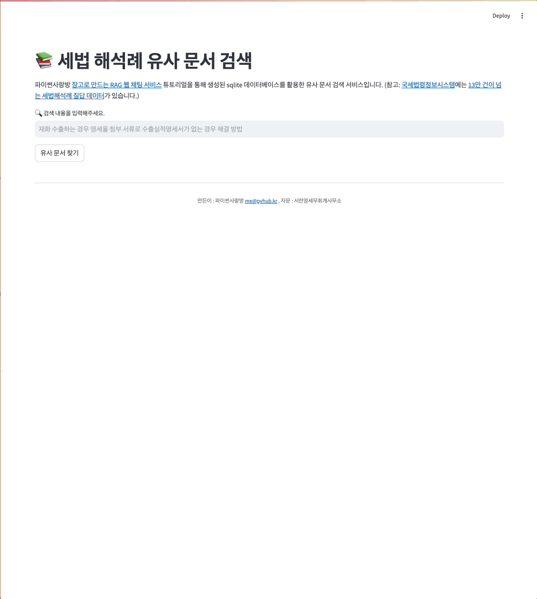

# Streamlit을 활용한 세법 해석례 유사 문서 검색

SQLite 데이터베이스를 Vector Store로서 활용했으며,
SQLite 데이터베이스에 저장된 세법 해석례 문서를 검색할 수 있는 Streamlit 애플리케이션입니다.
문서 임베딩과 데이터베이스 생성은 `django-pyhub-rag` 라이브러리 기반으로
장고를 통해 수행했습니다.
데이터베이스 생성 과정이 궁금하신 분은 [장고로 만드는 RAG 웹 채팅 서비스](https://ai.pyhub.kr/hands-on-lab/django-webchat-rag/)
문서를 참고하세요.

## 스크린샷

각 문서는 OpenAI `text-embedding-3-large` 임베딩 모델로 3072차원으로 임베딩했으며,
LLM 응답은 `claude-3-7-sonnet-latest` 모델을 사용했습니다.



## 데이터베이스

`sample-taxlaw-1000.sqlite3` 파일에는
[국세법령정보시스템](https://taxlaw.nts.go.kr/)에 저장된 [13만 건이 넘는 세법해석례 질답 데이터](https://taxlaw.nts.go.kr/qt/USEQTJ001M.do)
중에 1000건의 데이터가 저장되었습니다.
13만건의 데이터를 sqlite3에 저장하면 약 2GB 용량이며, 유사 문서 검색에 1초 미만의 짧은 시간 내에 검색이 가능합니다.

* `taxlaw_documents` - 세법 해석례 문서 레코드 포함:
  - `id` - 기본 키
  - `page_content` - 문서 내용
  - `metadata` - 문서 메타데이터
  - `embedding` - 문서 임베딩 벡터 (3072차원) : OpenAI `text-embedding-3-large` 임베딩 모델을 활용하여 3072차원의 임베딩 벡터를 생성했습니다.

## 주요 기능

- 코사인 거리 방식으로 유사 문서 검색 (최대 4개)

## sqlite 확장이 지원되는 파이썬이 필요합니다.

대개 윈도우용 파이썬에서는 sqlite 확장이 활성화되어있지만, macOS에서는 보안을 이유로 sqlite 확장이 기본 비활성화되어있습니다.
[django-webchat-rag 준비 문서](https://ai.pyhub.kr/hands-on-lab/django-webchat-rag/preparation) 문서를 참고하세요.
이 문서에는 벡터 검색을 위한 SQLite 확장 설정 방법이 자세히 설명되어 있습니다.

## 설치 및 실행 방법

1. 가상 환경 생성 (선택 사항이지만 권장):

```
python -m venv .venv
source .venv/bin/activate  # Windows의 경우: .venv\Scripts\activate
```

2. 필요한 패키지 설치:

```
pip install -r requirements.txt
```

3. OpenAI API 키 설정 (필수):

임베딩을 위해 [OpenAI API 키가 필요](https://platform.openai.com/api-keys)합니다.
문서에 대한 임베딩은 미리 생성되어있으며, 질문에 대한 임베딩 만을 실시간으로 생성할 것이기에 요금은 미미할 것입니다.

그리고 LLM 응답 생성을 위해 [Anthropic API 키](https://console.anthropic.com/settings/keys)가 필요합니다.
LLM 응답 생성에서 Anthropic API를 사용하지 않고 OpenAI API를 사용 하실려면
``chat_model="claude-3-7-sonnet-latest"`` 설정을 ``gpt-4o`` 등으로 변경해주세요.
그럼 Anthropic API 키는 필요 없습니다.

```
# Linux/Mac
export OPENAI_API_KEY="your-api-key-here"
export ANTHROPIC_API_KEY="your-api-key-here"

# Windows (CMD)
set OPENAI_API_KEY=your-api-key-here
set ANTHROPIC_API_KEY=your-api-key-here

# Windows (PowerShell)
$env:OPENAI_API_KEY="your-api-key-here"
$env:ANTHROPIC_API_KEY="your-api-key-here"
```

혹은 `.env.sample` 파일을 복사해서 `.env` 파일을 생성하고 다음 내용을 추가하세요:

```
OPENAI_API_KEY=your-api-key-here
ANTHROPIC_API_KEY=your-api-key-here
```

4. Streamlit 앱 실행:

```
streamlit run app.py
```

5. 터미널에 표시된 URL에서 브라우저 열기

## 개발자

* 파이썬사랑방 이진석
